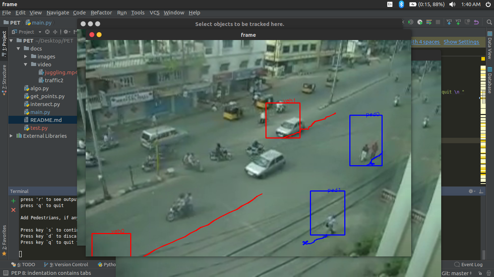
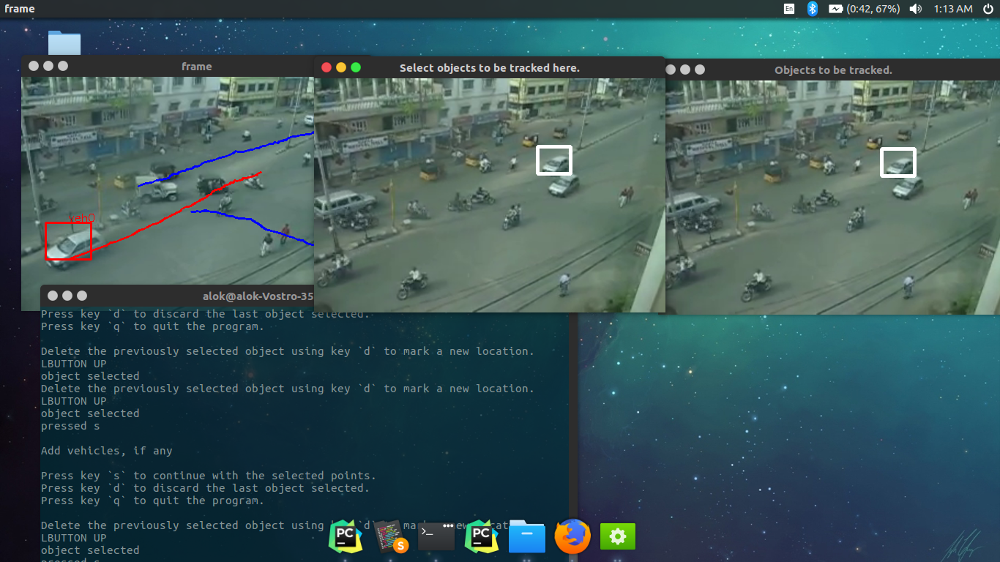

# Multi ObjectTracker
Advanced multiple object tracker using <b>dlib</b> and <b>openCV</b> library.
<br><br>


This is my summer(2017) project under the guidance of Prof P Vedagiri (IIT B , Civil department) at the end of my 2nd semester. This pertains to automating the detection of pedestrian-vehicle conflicts by using image processing. The objective was to find out <a href="https://www.researchgate.net/figure/7232990_fig1_Fig-1-Illustration-of-post-encroachment-time-PET"> Post Encroachment Time (PET)</a> values semi-autonomously.

These collection of scripts can also be used to track a group of user specified objects of 2 categories ( theoretically, it can be extended to more numbers ) as they move across the image.


## Dependencies

* [`Dlib` with Python support](http://dlib.net/)
* [`OpenCV` with Python support](http://opencv.org)
* [`xlwt` python package(for writing on excel files to store PET values)](https://pypi.python.org/pypi/xlwt)

## Starting the code

Tracking can either be done using a live video from a webcam or using a video file.

### Tracking using Video File

To run the code using a video file use the following command line argument --

```shell
python main.py -v <path-2-video-file>
```

For example, you can use the demo video provided with this code as --

```shell
python main.py -v docs/video/traffic2
```


Once the code starts, it will start the video file. To select the objects to be tracked, pause the video by pressing the <kbd>p</kbd> key. It will first ask you to  to create a bounding box around the object(s) to be tracked in the newsly created window. Press the mouse to select the top-left pixel location of the object to be tracked and then release the mouse on the bottom-right location of the object to be tracked. You can select multiple instaces of a type of object.. Also, if you want to discard the object, press the <kbd>d</kbd> key. Press <kbd>s</kbd> key to save the object and initiate the tracker.Each onbject is assigned an index, which will be useful in deleting instances of the trackers.



As the current code is configured for the project, this process is repeated twice, once to initiate pedestrians and once for the vehicles.Every object is assigned an index. This index will be helpful if we want to delete a certain object and add new ones. 
After initiating objects of both categories, press <kbd>r</kbd> key to resume the tracker and play the video. 

Whenever the video is playing, you can press <kbd>d</kbd> key to delete instances of the object. Further instruction will appear on the terminal window

You can always pause and resume the tracking. It doesn't lead to any lo

Press <kbd>q</kbd> anytime to gracefully quit the code

### Calculation of PET values


Additional flags -l is needed for calculating PET. The -l is followed by the length of the video to be played in seconds. This is important for finding out PET values, as we need the frame processing rate. The number of frames in the video comes to our aid

```shell
-l 1000

```

Trajectory of each object is tracked and stored. The algorithm in algo.py and intersect.py help in detecting whenever a vehicle lands at a point where the pedestrian was present erstwhile. If -l flag is provided then PET values calculated are stored in an excel file.

if the -l flag is not provided, main.py simply acts as multiple object tracker.
